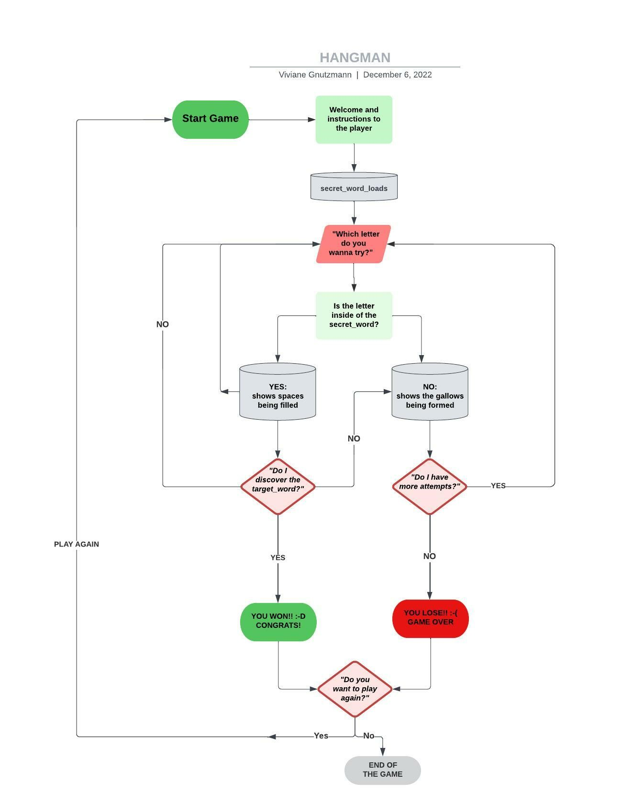
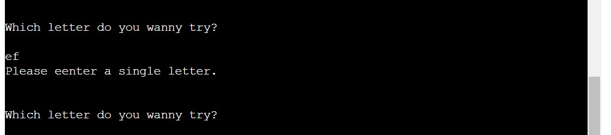

# The Hangman

  

[Link to Website](https://third-portfolio-project.herokuapp.com/)

[GitHub Repo](https://github.com/vivignutz/third-portfolio-project)

## About

Hangman is a popular guessing game for two or more players. One player thinks of a word, phrase or sentence and the other(s) tries to guess it by suggesting letters within a certain number of guesses. 

Originally a Paper-and-pencil game, there are now electronic versions, like this version developed with pure Python. 

The word to guess is represented by a row of dashes representing each letter of the word. If the suggested letter is in the word, it is written down in all its correct positions. If it isn't in the word, the player, who chose the word, draws a stage of the hangman. This process is repeated until the hangman's diagram is completed. The number of tries can change depending on how detailed is the gallows showed on terminal. 

This version is adapted for playing against the computer. All the words were chosen randomically and will be chose also randomically.  After a certain number of 7 incorrect guesses, the game ends and the player loses. Then a skull appears to the player, advising about his result. 

If the player discover the secret word kicking all letters right, a trophy appears to the player, congratulating him/her for the successfull game. 

## User Experience and Design

### Strategy used

-   Purpose of the game and why users users may want to play this:
    
    -   The aim of this game is to distract the players during the game. Each person can play a guessing game as a single player with a limited number of tries.
        
    -   To improve your ability of the user to think quickly about the possible words that would fit into the blank spaces.
        
-   Reasons for the website
    
    -   Offeiring to the user a few minutes of fun and entertainment.
        
    -   Giving to the user the possibility to play with his/her kids during a travel or en route to somewhere that takes much time.
        

### Scope

- What a user might want:
    
    - Clear instructions for playing the game.
        
    - Clear messages about how many wrong bets he has, how many letters he has already got right and his updated position on the gallows.
                
    - The possibility to check the rules at any time during the game by scrolling down the screen.
        
    - The possibility to return to the game whenever he wants.
        
    - That the wrongly kicked letter appears so that he has a view of the letters already kicked. 
        
    -   After each round, he can decide to play a new round or simply exit the game.
        
-   As a developer what I expect
    
    -   The user finds an entertaining and easy game to play.
        
    -   Well-commented code for easy maintenance.
        

### Structure

The game was thought so the user can have an easy navigation. The instructions are kept small, simple and clear, and come as a first step of the entire process of the game. 

A general flowchart was built to represent the logic of the entire game. During the programming process some changes wwre implemented while the tests process were running. 

  

### Surface

The game was built without any color to the default. 

The alerts of "win" or "loose" shows as a skull in case the payer loose, and a trophy in case the player wins. 

  

  

## Features

### Current Features

-   The Start of the game comes as first, when the player starts the terminal or app.

  

-   The secret word is showed with empty spaces instead of the letters. The win is invited to try a letter. 

  

-   The state of the hangman is updated every time the user chose a wrong letter, and the remaining kicks are also showed to the player, so he/her can have an idea if the danger of losing is near or not. 

  

-   At any point in the game, the user can scroll up to access the rules of the game. 

  

-   In the end of the game, the player can choose if he/her restarts the game to play again ("Y") or exits the game (choosing any other character).

  

### Future Features

-   A possible coming feature is developing a score system. So the user can have a chance to improve his/her skills once he/her starts to play and stays for long time playing.
        
-  Colorfy the game, so it can turn more attractive to the users. 
    

## Technologies Used

### Languages Used

-   [Python 3.8.11](https://www.python.org/)

### Technologie used
In alphabetical order:

-   [Am I responsive?](https://ui.dev/amiresponsive/): This page was used to know how the game would be in different gadges and screensizes.

-   [ExtendsClass](https://extendsclass.com/python-tester.html): Was used as a second validator to check if the syntax of the game is correct. 

-   [Gifcap](https://gifcap.dev/): Was used to build a gif for this documentation.

-   [Git](https://git-scm.com/): Was used for version control by using the Gitpod terminal to commit to Git and Push to GitHub.
    
-   [GitHub](https://github.com/): Was used as the repository for the project's code after being pushed from Git.
    
-   [Heroku](https://www.heroku.com/): Was used to deploy the application and provides an environment in which the code can execute.

-   [LucidChart](https://www.lucidchart.com/pages/): Was used to create the flowchart of the game system.
    
-   [PEP8](http://pep8online.com/): Was used to check the code requirements.
    
-   [Table Generator](https://www.tablesgenerator.com/markdown_tables#): Was used to generates the tables on the testing section.
--------------- COMECAR NO TESTING!!!!    

## Bugs

-  Intendation bugs
Some issues with Python indentation on the starts of the tests. The VSCode Indent Rainbow was installed and helpful to check this bug.

  

-  Game did not starts
The first test after the game was ready I had some issues with the start of the game. My mentor instructed me with the identations and it was solved after some changes at the code.

  

-  The correct letters (right_letters) isn't showing
When running tests, after some changes at the indentation, the kicked correct letters weren't showing. It was solved with help of a tutor, who gave me some hints to solve this bug.

  

 

## Testing

The game uses the command line interface, and since it isn't very user friendly to use in mobiles, the tests were runned in different desktop browsers which brought same results - all pass.

			- Chrome
			- Safari
			- Brave
			- Edge

### Functionality

>Test game running
>Check input’s length
>User srtarting enter a single letter to start the game.

>If user enters a wrong letter, the game starts desiging the gallows. 
>Hangman’s stages display at every wrong round and shows how much attempts the user still has.

>If user enters a correct letter, than the letter is filled into the empty spaces of the secret word. 

>If user enters 2 or more letters in same time, the game asks to insert one word each time.

  

>Play again or exit the game: users enters ‘Y’ to play again or other any other letter to exit the game.

  

### Validators

-  The  [PEP8](https://pep8ci.herokuapp.com/#)  validator was used to check if the code in the run.py has any problem. 
The test result was some warnings "W605 invalid escape sequence '\_':", anthough the functionality of the game works perfectly. 
This warning sequence with the default configuration W605 appears because of the designt of both figures: the trophy and the skull.

  

-  The  [ExtendsClass](https://extendsclass.com/python-tester.html) is a secontd validator used to check if the code in the run.py has any problem. The test result was: "No synthax errors detected :)"

  

- The  [Online IDE](https://www.online-ide.com/online_python_syntax_checker) was the third Python synthax checker used to check the code. The result was "Return code = 0".

  

## Deployment

### Deploy with Heroku

The deployments are donde thourgh the Heroku plattform.

**To create a new deployment/app**

-  I navigate to Heroku.com and inserted the login email and password. 
-  On dashboard clicked at "New App" and chose a new name for my app (thirt-portfolio-project). 
-  At the menu bar went to "Settings" and on "Buildpacks" chose "python" and "nodejs" packs - saved.
- Then at the "Deploy" on the menu bar, the GitHub method to deploy was chose. This will created a new Heroku app and link it to your Gitpod terminal. You can access the app via the Heroku dashboard.
- The deployment was chose to update automaticaly from GitHub.
- Once you have followed the appropriate step above, your Heroku app will be linked to your workspace.

**HOW TO DEPLOY**

After linking your app to your workspace with one of the above steps, you can then deploy new versions of the app by running the command  `git push heroku main`  and your app will be deployed to Heroku.

## Credits

-   To my mentor support, guidance, and tips to improve my coding skills throughout the project: 
	-   Brian Macharia
	
-   Checking functionality of the game:
    -   Conny Schlee

- To the tutors of Code Institute.

-   The steps to do a hangman game:
    
    -   [https://amadorprograma.com/2019/02/25/criando-um-jogo-da-forca-em-python/](https://amadorprograma.com/2019/02/25/criando-um-jogo-da-forca-em-python/)

-   Checking code information (syntax and uses):
    
    -   [https://www.w3schools.com/python/ref_string_isalpha.asp](https://www.w3schools.com/python/ref_string_isalpha.asp)
    
    -   [http://devfuria.com.br/python/sintaxe-basica/](http://devfuria.com.br/python/sintaxe-basica/)
        
    -   [https://codeberryschool.com/blog/en/python-functions/](https://codeberryschool.com/blog/en/python-functions/)
        
    -   [https://www.pythonforbeginners.com/basics/python-if-elif-else-statement]https://www.pythonforbeginners.com/basics/python-if-elif-else-statement)
        
    -   [https://www.w3schools.com/python/python_while_loops.asp](https://www.w3schools.com/python/python_while_loops.asp).

- How to unintend blocks of code:
	- https://www.folkstalk.com/tech/python-way-to-unindent-blocks-of-code-with-code-examples/#:~:text=Shift%20%2B%20Tab%20%23%20To%20unindent%20or.,Tab%20%23%20To%20indent.

## Aknowlodgements

This game was built as my third project for  [Code Institute](https://codeinstitute.net/global/).
